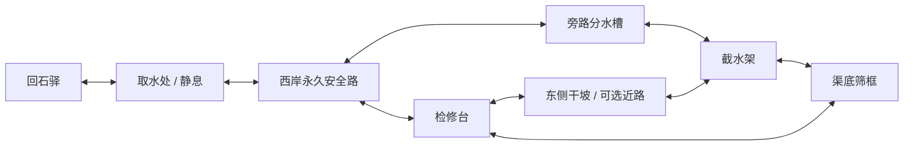

# 0.4 设计候选：雾岭旧渠

2026-09-11 · **供一次整体审阅的设计候选；未实现、未发布，不属于当前 0.3 试玩内容。**

本稿沿用已认可的原创低阶修士、空间冒险与人物生活方向。当前授权允许继续精修并收敛下一段设计；本稿不把“继续开发”解释为用户逐项认可了新地图、工序和数值。它给下一阶段提供一个可完整评估的范围，实施状态另记。

## 1. 这一次为什么出门

回石驿收到雾岭旧渠看渠人邵禾的口信：取水槽已经停流，她先前巡渠时找到一处堵塞，如今要留在下游分水取水处照看前来取水的人，不能离开此处在上下游奔走。她会维护器具、徒手推分水板，请玩家代为走完察看、改水路和下渠清堵这一段。许照原本就想核对这条山外采药路，邀请玩家走一趟；拒绝同行时，口信仍留在驿中桌案，玩家可以独自接下。

玩家要亲自看清水路、清除堵塞、让下游取水槽重新进水，再回驿把实际走通的路线记在地图上。主问题是“怎样暂时改变水路，腾出安全动手的空间”，不要求击败守关敌人，也不增加境界。

- 体验类型沿用 hybrid：观察、移动、牵引、护持、就地操作；人物回应实际行动。
- 短循环：看水流与支点 → 改变一处器物 → 看通路与压力改变 → 进到原先不能停留的位置。
- 长循环：约定同行 → 发现停水原因 → 选择办法清渠 → 亲眼验水 → 归驿留下新路与来往。
- 新增一张地图、一个支持短线人物、一个完整清渠事件；预计首次 15–25 分钟，仅为制作预算。
- 不以两项 0.3 委托全完成为入口：首章桌边结局完成即可接取；压扣、药囊和许照同行均可缺席。
- 首分钟在驿中看见口信、确认去处并走向出发点；到新图第一屏先见干燥取水槽和上游水声，获得一个清楚目标。

## 2. 原作依据与新增边界

| 类型 | 本稿使用方式 |
|---|---|
| immutable | 沿用 [SOURCE_SCOPE](SOURCE_SCOPE.md) 的恒岳失山门背景、赵国地域和王林既定经历；不另定王林当天位置。 |
| adaptable | 基础引力术移轻物、普通劳作与有限灵力结合、求助者有自主意愿，沿用 [SOURCE_BIBLE](../docs/research/analysis/SOURCE_BIBLE.md) 的已有整理。 |
| open | 雾岭旧渠、邵禾、停水事件、所有水工器具、草叶用途、人物对白及具体物理参数全部为原创改编。 |
| conflicted | 原作时间间隔歧义仍保留；本段只说“上次归来后”，不补精确天数或失踪宗门人物的去向。 |

水闸不是阵法，压扣不是新法宝。玩家仍只能直接牵引已标记的轻板；不能把整渠水、人物或巨石当可牵对象。修渠不写成原作宗门工程，不给玩家天逆、王林传承、独占关系或跨境界奖励。无新增小说全文读取与全书解析。

## 3. 人物真正想做什么

| 人物 | 自身目标与筹码 | 会怎样回应 |
|---|---|---|
| 邵禾，原创看渠人 | 要恢复取水，也要保住检修用的干路；知道分水板的旧槽口，自己能维护固定器具，却不能隔空操控。 | 起初指向上游，请玩家先察看，不断言堵塞原因。玩家告知实际察看到的筛框歪卡、枝叶聚堵后，她才确认原因；筛框始终留在渠中，由玩家原地扶正清理；两条办法都接受。她只在取水槽真正稳定进水后承认修通。 |
| 许照，既有同行者 | 要得到可供自己走的路，不愿把“修士能飞快过去”当成普通人安全的证明。 | 同行时停在安全候点，读真实水位与通路；通路安全后才继续跟随。不在场就不说亲眼见过，也不因新章节清除旧拒绝事实。 |
| 陶七，留驿熟人 | 想知道修出的压扣是否合手，不要求玩家为证明手艺而冒险。 | 回来仅在压扣确实用于旧渠时谈承托；没用就问实际采用的办法，不捏造共同修渠经历。 |

邵禾是一次支持短线，不增加好感条、任务商店或第三名可招募战斗同伴。她的行为只包括固定位置的察看、指路和最终验水；不靠新增 NPC 专用操作 AI 完成关键步骤。

## 4. 一张地图里的空间

地图暂定 1800×1200 世界单位，方向固定；坐标用于说明空间关系，白盒可以调整，但不能缩掉安全侧、退路或操作距离。由回石驿既有外出点选择“去雾岭旧渠”进入；四张旧图和原出口保留，两个目的地要明确点选。

| 地点 | 位置与可见地标 | 实际用途 |
|---|---|---|
| 下游取水处 | 西南约 (260,960)，瓦檐、石槽、停住的小水轮 | 入口、邵禾、静息点、返回驿站；水轮只读通水结果，不是另一个谜题。 |
| 旧渠检修台 | 中央约 (880,610)，裂口石堰、红褐木尺 | 能看清上游来水、堵住的筛框和两条水道；高岸始终可站，不靠跳跃。 |
| 旁路分水槽 | 西北约 (600,350)，双槽口与轻分水板 | 长路线的核心装置；向旁路分水时，东侧低踏道被浅流封闭，西岸仍通。 |
| 上游截水架 | 东北约 (1280,350)，横滑截水板、固定眼、短木梯 | 短路线的核心装置；临时截水使渠底可进入，板退出槽口后重新来水。 |
| 筛框凹槽 | 约 (1100,540)，浅渠底，两侧各有台阶 | 真正清除堵塞的位置；截水架安全交互站位约 (1230,410)，距板约 78；到筛框近身站位 (1130,540) 的实际台阶路径预算 180–200 单位，返回同路。 |
| 东侧干坡 | 东部约 (1490,620)，弯松、兽痕、上岸长路 | 绕开低踏道，前后各接高岸；两只山兽只在内弯活动，外缘窄步道全程无兽。 |

水只取“原渠受阻”“旁路通流”“上游暂截”“原渠修通”四种可读局面，不做泛洪、游泳、浮力或自由水体模拟。两装置都动过时，上游暂截优先；恢复上游后依分水板位置决定旁路或原渠，不让最后一次点击覆盖另一器具的实际位置。渠底危险与岸上安全的边界必须和实际湿线一致。雾只在远景和岸外缓动，不遮人物、目标、落点和水尺。

## 5. 完整事件链与两种动手办法

1. **接下查看旧渠。** 桌边接受邀请或口信，独行/同行均可；新图入口开放，不自动传送或清空原任务。
2. **沿水声察看。** 走至检修台，近身察看歪卡的轻木筛框；看到上游有水、下游干涸，确认“筛框卡斜、枝叶聚堵”。第一条说明只给事实，展开察看才列办法。
3. **选择实际操作顺序。** 不先弹“路线 A/B”；玩家走向装置并动手，最终按发生的工序记事。两路线可以中途互换，不重开任务。

| 步骤 | A：先分水，再从干渠清理 | B：暂截来水，趁空档清理 |
|---|---|---|
| 准备 | 沿永久西岸到分水槽；近处看见“旁路会淹没低踏道”的旧水痕。 | 沿干坡外缘或尚未过水的低踏道到截水架；先看清下渠台阶和回程。 |
| 改变水路 | 把轻分水板沿导槽移到旁路槽口：可引力术牵移，也可近身连续推 2 秒，固定槽自动承托，不需要奖励压扣。 | 引力术把横滑截水板推入止水槽，追加留势后放手；可在此时安装随身压扣，让支承不受 8 秒限制。只有保持止水，渠底才会退水。 |
| 进入 | 旁路出现流水，原渠 1 秒退水；走干渠台阶到筛框。旁路稳定，无操作倒计时。 | 原渠 1 秒退水；留势剩余时间从原 8 秒中扣除，从安全交互站位沿 180–200 单位台阶路径到筛框近身站位。压扣固定则没有时间压力。 |
| 清堵 | 手空且筛框处已退水，近身扶正并清走框上枝叶，连续操作 2 秒；过程中可以取消重来。 | 同一真实清堵动作，不弹窗自动成功；途中施术、移动或受伤中断。留势法需要按实机速度证明去程、清堵、回程有余量。 |
| 恢复与验水 | 回西岸把分水板推回原槽；来水经已清的筛框进入原渠，低踏道重新干燥。 | 先回到截水架安全侧，解除留势或取回压扣；来水经已清筛框进入原渠。 |

4. **沿渠亲眼验水。** 原渠畅通并维持 3 秒后，下游水轮开始转；玩家仍需步行回取水处，与石槽互动确认水位。3 秒是流动表现，不要求站立等候，也不在菜单中偷跑。
5. **邵禾确认通路。** 与她交谈，实测结果才解锁返驿记录；若仍在旁路分水或截水状态，她指出哪一处未复位。仅清掉枝叶不是任务完成。
6. **归来落笔。** 回驿桌边亲手把路线图添到已有地图旁，结算一次冒险结果；可继续出门重访，不强制“重新开始”。

B 的留势窗预算按步速 160 单位/秒计算：退水 1 秒＋往返 360–400 单位用时 2.25–2.5 秒＋清理 2 秒＝5.25–5.5 秒，8 秒内余 2.5–2.75 秒；预留约 0.5 秒点选与方向切换后，约有 2 秒操作余量。这是路径预算，不是已测通关成绩，必须由桌面和手机白盒实跑确认。

A 的代价是绕行和两次移动分水板，收益是无资源、无倒计时。B 的代价是灵力，另可暂借唯一压扣，收益是短路线、东侧踏道保持干燥。灵力不足且压扣留在眺台时 A 更合适；留势熟练时 B 节省折返，带扣则能取消短窗压力。B 两种变式都先用留势腾手，避免让长牵玩家一面操控一面安装压扣。长牵玩家完整使用 A；不要求回驿换流派。

## 6. 奖励怎样派上用场，怎样不把人卡住

- **压扣可选用途：** 新增截水架一个固定眼；沿用“到位、近身、无遮挡、手空或留势”的安装规则。板固定后不能被二次牵走；取回时若玩家/许照仍在即将来水的渠底范围内就拒绝，提示先上岸，扣仍留原位。
- 固定眼从安全台阶顶可达；许照只会留在高岸候点。玩家离场时扣仍装在旧渠，行囊明确显示地点；不得自动回袋、复制或销毁。原 home/lookout 安装事实完整保留，出发前可以自行取回。
- **药囊可选用途：** 把现有驱兽规则明确扩到雾岭的两只山兽，仍为两份总量、脚边半径 150、8 秒、只驱离不伤害。它使干坡内弯更容易通行，不影响水流、人物或关卡结算。
- 已用完两份、尚未做采药委托、或旧兽已退去的玩家都可走干坡外缘安全路；不生成必须烧药才解除的堵门兽。
- 药囊在旧工棚仍起效时，不能同时在旧渠再放一份；保存其所属场景和原位置，返回该图才继续计时。说明必须写明现有气味在哪一图，不把布囊带着玩家传送。
- **零资源退路：** A 从入口到清渠、复位、验水全程可徒手完成，既不消耗药囊也不要求恢复灵力；两条高岸路不受水位影响。静息仍是额外便利，不是暗中强制补满后才能过关。
- 无全局截止时间。水退回时若有人仍在渠底，先给可见来水预告，再依原受伤保护规则损失至多 1 体力并移至最近可达岸点，不连续扣血、不让尸体或掉落堵路；具体预告窗由白盒确定并回写。

## 7. 归来变化与成长收益

这次成长是学会读水路、获得一处可反复抵达的休息处，并让既有手艺改变办法。验水完成后，邵禾把检修台上的旧坐垫铺回干处，该处成为地图中段的新增静息点，重访试术与取扣能少走一次入口。体力 4、灵力 6、术法消耗和流派能力不提升，不另发材料货币。

| 实际结果 | 看得见的回响与用途 |
|---|---|
| 清渠、验水、返驿落笔全部完成 | 桌案增加旧渠小图；以后在同一外出点可直接往返旧渠取水处，筛框保持清理完成，初次归来时水轮与水槽正常通流。 |
| 与许照实际同行到安全检修台、再共同验水 | 图上增加她现场画下的干坡记号；回驿她承认这次一同核对过路。独行只写玩家自己的记号。 |
| 采用旁路清理 | 邵禾把旁路水痕补画到检修牌，重访可读到该路会淹低踏道；不写用了留势或压扣。 |
| 采用留势或压扣截水清理 | 检修牌标出安全台阶；陶七按真实用扣事实回应，未用扣不称赞不存在的试用。 |
| 重访试术后压扣又装在旧渠 | 图旁留一个明确的取回地点提示，回去可取；任务完成不会替玩家收走它。 |

完成后可以再操作水板试术，水轮仍按当前真实水路转停，清理与验水的历史事实不重置、不重复奖励。邵禾不远距目击全部工序：验水对话中由玩家按实际经过说明办法，她才补画检修牌；仅在场的许照可以主动补充。

最后一个标志性画面：跟随水声从原先干渠走回瓦檐，停着的小轮转起来，邵禾挪开挡在取水槽前的空木桶，许照若在场才走来试水。人物和水位由已完成状态驱动，不以不可操作过场代替验水。

## 8. 存档与中断范围

保留 schema 1 与现有 revision；候选新增内容版本 3、新区域、冒险阶段、分水板位置、截水支撑、筛框清理、验水与落笔事实，并把压扣位置扩为“旧渠”。最终字段与边界校验由实施计划定义，不在 UI 另记一份任务进度。

0.2 旧档先依现有流程迁到内容 2，再补内容 3；0.3 档只添加未接取的新任务和新图默认实体，不能自动续章通关、领奖、补药或挪扣。首章未完成档看不到新邀请。外层和唯一嵌套 checkpoint 都迁移，未知内容版本与非法跨图气味/压扣组合拒绝。

保存覆盖半途分水板、留势剩余、已装压扣、清理进程、四种水路状态、药囊所在图与剩余时间；载入保持暂停，不用读档推进水位。切图取消未完成的徒手推板/清理；无固定支撑的截水板按原离场规则复位，已清理与已安装事实保留。

重试回到实际处境快照，消耗与物件一起回退，不同时保留药囊使用结果和旧数量。重开创建全新冒险状态。关闭首章结局界面不会清掉首章已完成标记，也不会触发新章节结局。

## 9. 制作入口与验收

最大风险是“B 的时间窗在手机上是否从容可读，以及 A 是否只剩冗长走路”。先做包含两装置、真实水位碰撞、完整安全岸路的俯视空间白盒；不用对白流程证明可操作。固定初始局面，无随机水位或敌人刷新。

1. 用长牵、零灵力、零药囊、未获压扣、独行的首章完成档，实际走完 A、验水、返驿落笔。
2. 用留势、满灵力完成 B；桌面和手机分别实测去程、2 秒清理、回岸。若只能靠精确像素点选或用尽全部 8 秒才活着离开，先缩短安全台阶距离或放宽交互站位，不偷偷增加留势时长。
3. 用留势与压扣走 B，覆盖原眺台取扣、旧渠安装、拒绝危险撤扣、上岸收回；不能双装，不能丢失唯一扣。
4. 途中改用 A/B、过早复水、清理中断、暂停、失焦、保存载入、退回和重试均保持一致；两路归来记录不得串线。
5. 真正把药囊放在活兽附近并看到绕行，同时以空药囊档完整走安全外缘；验证旧工棚气味与新图不能同时占用同一份起效状态。
6. 新图每个主要装置在桌面、矮窗口和手机清楚显示贴地位置、可操作面、水流方向和安全台阶；雾、屋檐与字幕不得遮住结果。
7. 首章两条归来路线、0.3 双委托与旧档迁移继续通过；发布前使用真实输入完成新冒险两法、重开及公网资源核验。Chrome 触控仿真和实体手机分别报告。
8. 若第一次察看后玩家仍无法说明“哪里有水、哪里能站、哪个物件改水路”，先改装置构图与水位反馈；若 A 无任何观察只需长按点完，则压缩折返，不额外添任务凑时长。

本候选选择“一处水路的两种操作顺序”，暂不采用战斗营地或大型遗迹：前者会要求新的战斗行为与敌人制作，后者易扩成钥匙收集。代价是战斗增量很少；收益是把现有术法、手艺与有限奖励组合成可完整验收的新局面。整体审阅应关注这个取舍及新区域规模，既有身份、画风方向和旧系统不重复征询。
