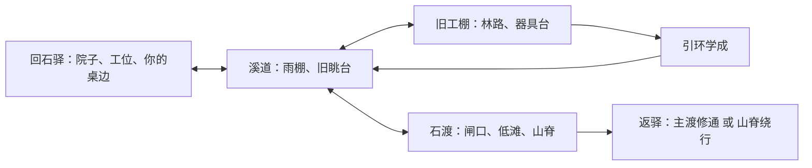

# 《仙逆：山门之外》首版详细设计

2026-09-09 · 设计候选 v1 · **待用户一次确认，未实施、未试玩**。

阅读入口：[一页审阅](REVIEW.md) → 本文 → [美术方向](ART_DIRECTION.md)。原作依据与限制见 [SOURCE_SCOPE](SOURCE_SCOPE.md)，技术取舍和后续阶段见 [DELIVERY](DELIVERY.md)。本文中所有人物、地点、事件、操作、时长与数值，除明确标为 immutable 的原作背景，均为 open 的改编设计；不回写研究稿。

## 1. 我在扮演谁

玩家是在赵国山道的**回石驿**住了半年的原创低阶散修。做过杂活，跟过一位途经的散修学会基础术法，如今凝气三层，能施术却还没独自走过远路。自取姓名；形象两款，经历和行动权限相同。三层及这段履历是设计安排，不推导原作境界与通用术法权限表。

恒岳失去山门后的初期，山路来客骤多。你此前托人在旧工棚修整的普通法器“引环”已经修好，雨水却冲坏了取物的路。今日想拿回自己攒工钱换来的东西，试出合手的用法，走通通往外界的渡口。回石驿既是出发点，也是你可以决定继续住下的地方。

创建时只作两项有下游用途的选择，无长问卷：

| 选择 | 已有经历与起手习惯 | 场景中的实际差异 | 回来后怎样记住 |
|---|---|---|---|
| 药铺帮工 | 替驿边药铺晒药、送药，懂包扎和辨识常用草药 | 溪道直接认出止血草；能给许照整理药包，换她腾手指示干燥踏脚点；不耗唯一伤药即可处理她的轻伤 | 晒架上出现你分好的草药；许照会邀你看自己的采药图 |
| 修器学徒 | 在驿中修过灯架、车轴，认得受力和旧修痕 | 溪道看出绳扣受力，能徒手固定小舟，释放牵物名额；能把工棚台钳作为临时支点 | 陶七把修过的灯架放回你的桌旁；工位留出引环练习位置 |
| 想有个自己的修行处 | 一句当前心愿，不锁职业 | 中场可与陶七谈驿后空屋，获得结尾整理练功角的主动话题 | 你亲自选定引环挂钩的位置，窗外是已改变的渡路 |
| 想有本领走出去 | 一句当前心愿，不强制离开 | 中场可向许照问山外路线，结尾能提出同行练习 | 她摊开已经共同标过一处路的地图，约定下一次短途 |

两种经历共享三项术法和全部主线，不以背景排除核心内容。非对应背景可向本人学到本次实用步骤，但要共同动手完成一段操作；背景的收益是已有熟悉关系、独立判断和不同做法，不是伤害加成。心愿可在归来时改变，NPC只回应前后说过的话，不扣“违背人设”分。

**玩家承诺**：我能走进局面，看出自己可用的东西，施术改变它；逐渐有惯用的办法，也有人愿意和我再走一趟。

- `experienceProfile`: hybrid，空间行动主导，人物生活和后果支撑。
- 核心动词：察看、牵引、施术、交涉、同行。
- 短循环：看见目标和阻力 → 预览/试探 → 移动施术 → 现场变化 → 调整下一步。
- 长循环：在驿中备行 → 取回引环 → 练出自己的用法 → 处理渡口 → 回来看人、物与去路的变化。
- 首分钟：玩家已在可走动的院中；陶七正在扶歪了的灯架，你用引力术把灯盏放回去。他松手，灯亮起来，桌边露出留给你的碗。15秒内取得控制，60秒内至少一次移动、选物和术法反馈。愿意练习可继续，不强制把三招教程全部读完才出门。
- 原作转化：低阶修士有灵力却没有上层裁决权；宗门更迭改变普通人的行路，凡俗手艺仍有用。玩家改变小范围的通路、物件和同行关系；恒岳与王林的既定经历保持原位。
- 玩法先例沿用 [CONCEPT A](../concepts/CONCEPT.md) 已有研究：空间战术、观察和人物回响；不再重新做概念比较。

## 2. 范围、操作和空间

目标为首次完整游玩约30–45分钟，包含自愿停留与探索；这是预算，熟练直走可以更短。不给路线加等待或刷怪。一个落脚处、三个相连外景、六个主要处境、两位核心原创NPC、两种地理结局。无联网账户、自由文本指令、日常签到、生产经营、随机词条装备、全书地图或长职业树。

俯视斜角二维场景，人物连续走动，固定镜头朝向；场景跨度约2–3个视口，地面交互按平面处理，坡道明确连接高低处。木箱、绳扣、石板必须在场景中实际改变位置或通行，文字选择不得代替执行。

| 操作 | 规则 |
|---|---|
| WASD/方向键；单击空地 | 连续移动/点击寻路。键盘立即接管点击移动；不会替玩家穿越已知危险区或自动施法 |
| 1/2/3与屏幕三枚术法钮 | 选择牵引、火焰球、护身；指向目标见范围与阻挡，左键确认，Esc或右键取消。触控板只需单击即可完成全部操作 |
| 空格与暂停钮 | 立即暂停世界；可看局面、预览并指定**一个**待执行动作，改选覆盖前一动作。恢复时重新检查目标/路径，不合法则停下说明原因，不自动换目标 |
| E/点击近身人物或器物 | 明确的就地互动；有多个目标时显示可切换的名称，不触发最近的陌生对象 |
| 拖曳镜头/屏幕边缘箭头；C | 暂停下察看当前已探索场景，C回到角色；不揭开未到访空间。行走时镜头缓跟，威胁出现保持玩家与威胁同屏 |
| 记事/行囊/设置 | 暂停世界。场景目标仅一句；完整对话、共同经历、物品说明按需读。背景标签不反复弹提示 |

失焦自动暂停；剧情对话暂停整个当前场景，包括投射物和危险计时。同伴不在暂停期间替玩家解决问题。结束对话仍停在暂停状态，由玩家恢复。玩家随时可保存，包括战斗暂停处。

## 3. 三种手段与成长

以下距离单位是设计用的“步”，反馈显示可达范围，不要求玩家心算。数值仅为白盒初值，修改需回写理由。

| 手段/稳定ID | 前置、效果与用途 | 消耗/边界 | 玩家如何看见 |
|---|---|---|---|
| 引力术 `pull` | 可见且6步内，牵引一件标注轻物至可达落点；可搬踏石、牵绳扣、用松木挡追击。能夺离地的松散兵器，不能直接拉人 | 启动1格灵力；一次最多一件，牵引时可慢走，但不能同时施另两术；距离、障碍变化可中断。取消前未生效不耗费 | 细线连接手与物，地面落点虚影，阻挡处显断线；实物落稳后线断。不以未标记的任意装饰试密码 |
| 火焰球 `flame` | 可见且8步内，直线投射；点燃干引火物、焚断枯藤、迫使野兽退让、打断敌人施术 | 每发1格；短准备0.5秒、发出后1秒间隔。湿物不会燃，遮挡会截住；不模拟无限蔓延。对普通对手命中削1格抵抗 | 瞄准显示第一碰撞物；干湿有材质和名称提示。火球点亮近处，击中、熄灭、打断各有不同反馈 |
| 护符·障 `ward` | 对面前方向张开2步宽屏障；挡一次敌方投射、正面扑击或落石，并可让跟在身后的同伴安全过窄段 | 用同一件可反复催动的普通符具，每次1格，持续6秒或承受一次命中；启用后3秒才能再启用，不叠层、不反弹、不挡侧后和洪水 | 扇面外缘与朝向可见；命中出现缺口后消散；转向由瞄准决定。符具的重复使用和定向形态均为 open |

护符·障是你此前用工钱向过路散修买来的制成符具，开局已会催动；物品说明明确它是本作原创，不代表小说中所有仙符的固定性能。挡扑击只中断当次冲击，不形成持续实体墙。保护动作生效后可移动及施火球；牵物仍只能单件。不设普攻连点：战斗用地形、退路和术法；普通对手抵抗值3格，连续站桩三发虽然可赢，暴露和灵力代价会让有准备的打法更从容。

**引环不是天逆或传承至宝。** 玩家事先付钱修整，工棚里的物权清楚；取回后经过一次无危险试用，选择一种收束灵力的路数。先示范两种，再让玩家亲手试，第一次取舍可立即改，之后只在驿中工位换练法。

| 惯用路数 | 新参与手段 | 首次用途 | 第二次迁移用途 | 实际代价 |
|---|---|---|---|---|
| 长牵 `long_pull` | 引力术由6步延到10步，仍只牵一件 | 从溪道旧眺台牵下远处绳梯，进入先前能看到的小平台 | 渡口在追击范围外牵闸扣、拉开掩体，保持人与施术对象的距离 | 仍需持续操控，不能一边牵住悬物一边火攻；不增加伤害 |
| 留势 `hold_pull` | 6步内牵物可追加1格，将物停在当前位置8秒；手空出来可另施一术，但不能再牵第二物；到期落下 | 暂定倾斜木梁，从梁下穿过到小平台；足够一次通过，有剩余时间轮廓提示 | 悬住挡板，绕到侧面施火或持盾引同伴通过；也可临时隔开两名对手 | 单次更耗灵力，时间结束前要退出落点；暂停冻结时限 |

两路都能到同一可选小平台，但操作和后续战斗习惯不同。平台内侧有可徒手放下的回程梯，登台即可看见，不需灵力也能返回；留势到期时若人仍在梁下，梁撞人减1体力并将其推至最近安全侧，梁不能永久封住角色。平台给出一处可安静试术的天然凹台、一段许照的私人采药记号和一枚可挂在驿中窗边的风铃；不追加第四个外景或唯一通关钥匙。

首版不跨境界。成长弧为：已有基础 → 取回并掌握合手法器 → 把新用法带回旧场景 → 在渡口自主组合。结尾期待是“明日有可去之处和愿同行的人”，不是筑基解锁按钮。

## 4. 资源、对抗与恢复

只保留一个核心系统（空间中的移动、施术、物件与威胁）和两个支持系统（引环用法；人物经历与归来回响）。行囊仅三术具、引环、两份伤药与有限纪念物，不设负重经济。

| 状态 | 初态及变化 | 读取与防死局 |
|---|---|---|
| 灵力 | 上限6格，每次有效术法按上表消耗；无战中自然回复 | 安全落点静息一次立即补满，不等进度条。开场院子、溪道入口、工棚内、渡口入口均有落点；交战未脱离不能静息 |
| 体力 | 上限4格；攻击/落石命中减1，被击后1秒保护，不能同帧连扣 | 安全静息恢复；伤药在现场即时回2，共两份，不靠重复回驿刷补给；开局、恢复点重试按快照恢复 |
| 暴露 | 敌人依视线由巡看→警觉→追赶→搜索 | 6步可见范围，初次发现有1秒提示；离开视线3秒后搜索固定末见区域，不穿墙追踪。受击或目击火球轨迹同样触发警觉，依据可见来向接近或寻找掩体，不穿墙知道施术者位置。抵抗耗尽则退出当前争夺，不刷新复活 |
| 同伴位置/意愿 | 自主走到相邻安全候点，过窄段等招呼 | 不踩可见火线与洪水；无友军伤害。不能命令其顶攻击、抢夺明确属于旁人的物件；拒绝不永久锁主线。敌方攻击命中同伴一次，她便退到最近遮蔽候点、暂停该段协作；危险解除后招呼可重组，不设同伴死亡或独立血条 |
| 物件与通路 | 搬动、烧断、固定等持续到重试/新周目 | 焚毁仅作用于标明可燃的一组物，不可把唯一退路烧到无法离场。重要路线改变立即存入当前局面 |

野兽在干草火燃起后改走外侧；火熄前不会反复扑同一火口。渡口散修看到正面屏障会侧移、绕挡板或等其消散；被移物声吸引者去查看实际落点，不会自动知道玩家躲在哪里。其施术准备有1秒可见起手，可被火球命中打断。双方不随机暴击，首版无掉落概率。

**预算例**：6格进渡口，牵闸1＋护身1＋火球打断1＋留势追加1＝剩2；足以完成组合并撤出。战斗硬拼两个3格抵抗对手需至少6发、耗尽灵力，且要承受回击，未预留护持；可以分隔后逐个处理或彻底避战。完成某条路不要求清空敌人。零灵力也能步行退到入口安全点；物件不得堵死这条人行撤退线。

受击是可继续的挫折；体力为0时冻结，指出可观察原因（例如“护身朝前，侧面飞石击中”），可重试当前处境或撤回最近安全落点。重试恢复**处境进入前**全量快照，敌人、物件、耗物和关系一起回退，禁止重复领奖。撤回保留此前已完成处境、引环成长和已发生的交谈，只重置未完成遭遇；不会被NPC骂“死过一次”。

存档保留自动安全点与一个手动档，写入失败明确提示并允许导出；导入同版存档可恢复。随时“重新开始”在覆盖当前档前说明，将姓名/背景以外的本轮状态恢复初态；可选更换背景。不以小说复活法术解释读档。

## 5. 四处地方与六个处境

| 节拍/预计时长 | 玩什么、为什么来这里 | 空间与可比较做法 | 世界/人物回读与离场条件 |
|---|---|---|---|
| 驿中起居 3–5分 | 灯架教学；取物是自己的计划。陶七指出引环已修好，许照也要去溪边察看采药路 | 一屏可见院、桌、出口；可查看留物与背景对应工位，选心愿；备行不进商店面板 | 许照提出同路，玩家可邀她随行或约溪道会合。主线消息交代完即可出门 |
| ①溪道搬物 3–4分 | 一只装着你们路用器具的小舟卡在浅滩；先取自己的行囊，再去工棚 | 正路踏石安全但绕；牵舟靠岸快却占用引力术；修器背景可固定绳扣，药铺背景能指许照走干燥处共同扶舟 | 许照按实际分工帮忙，器具取回后可前行。该舟不承担陌生人的生死期限 |
| ②雨棚同行 3–4分 | 雨歇下谈修行、包扎许照先前割伤的手；下方药筐正受雨棚导水板保护 | 直接拉走导水板可搭近路，但水线会淋到她的筐；先把筐挪入棚再借板、用护持过落石窄段、走上方长路均可 | 借前水线和筐同屏。未经招呼直接淋湿药筐，许照当场收物、改为前方等候；及时放回并晾物才恢复这一段协作 |
| ③林路取器 4–5分 | 工棚前两只护食野兽拦正路，你的引环在内侧台上 | 火点干草逼其绕行；牵空筐制造远处声响后从侧路穿过；护身挡首次扑击再撤到木栅后。取器不用杀光 | 野兽走位读取火和声，不能把同一诱饵无限当新声。工棚内是安全空间，取得自己的引环 |
| ④工棚试术 4–6分 | 陶七先走熟悉上路来送修具，在此与你试环；选择长牵或留势 | 无伤害试台可尝试两路；陶七固定测试架，不代替玩家施术。许照在场时将新用法联系到前路；不在场则在溪道会合后观看一次 | 亲手成功一次后获得所选用法；可谈空屋/远行，形成下一步安排；不以阅读口诀即掌握结算 |
| ⑤溪道再访 3–5分 | 同一个眺台如今有新走法；可选取风铃、看采药记号、短暂停留 | 长牵拉绳梯，或留势托梁从下穿过；也可直接去渡口。镜头让旧阻碍和新施术范围同屏 | 若许照共同登台，她补上一段只有这里会说的路线经验；未登台结尾不伪造共同回忆。陶七留工棚收拾，不跟进冲突 |
| ⑥石渡处置 7–10分 | 试走远路需要过渡；涨水堵了主道，两名低阶散修把持干燥入口，想收走路人的法器抵路资 | 先从安全入口观察闸、水、散修与高处绳梯。可证明能疏通水路换通行；可实际修通主渡逼其失去卡口筹码；可从侧面绕山脊；也可分隔、打断使其退走，再选通路。无交涉等级骰 | 通路读取实际闸口或山脊到达状态；对手读取示范与战斗，同伴读取站位和协作；过渡后可亲自返驿 |
| 归来 3–6分 | 你带回法器与走过的路，亲自进驿看改变，决定眼下想住还是想走 | 不直接跳结算。灯、碗、工位、出行图以同一机位回读；能与两人各做一次有内容的互动 | 路况决定实物与来人位置，同行史决定邀请。玩家在桌旁放下引环/展开地图才收束；之后可在已完成区域散步试术 |

不参与可选雨棚照料或眺台时，许照照自己的计划处理，不罚玩家主线奖励；她对共同经历的亲近也不会凭空出现。六处境复用同一组能力和器物语法，不各自建立专属谜题界面。

### 渡口的可执行布局与取舍

入口安全台能看见主闸、两名散修和山脊绳梯下端。入口公用修路箱提供木楔，箱上标明供行路人使用，不需偷窃、背景或付费。主闸旁的松闸扣受水压回弹，松手便回落。可先从近侧掩体把木楔放入闸脚导槽，再牵开闸扣，木楔随重力落下固定；长牵可退至安全高台执行，留势可锁住闸扣后亲自绕去放楔。基础能力也可先放楔再近侧牵开。固定后，水流永久转入**已目视无人的泄水槽**，低滩转为可走。木楔落下不占牵物名额，成长提高选择自由，不是硬门禁。

山脊线只供步行，入口有可牵下的绳梯与短落石段；用观察避开间歇落石或护持通过，尽头回接驿后小径。携长牵更容易从远处放下梯；留势可固定临时挡板带许照过窄段。未取得引环可探索入口，但主线取物尚未完成，不能提前触发归来终局。

两名散修的筹码是把住少数干地，并非宗门执法权。他们能看见涨水但不知道闸能修。玩家先察看闸痕，能实际示范小幅放流后提出“我把下面的路通开，你们让道”；对方让出一处施术位，主闸修通后兑现通行。若只说自己能做却没示范，对方要求先动手；不会凭一项对话直接判闸已开。可取消协商改走其他路线。

取舍会随局面翻转：

| 局面 | 较合适的做法 | 原因及可预判信息 |
|---|---|---|
| 许照已在遮蔽候点、木楔在手、未暴露 | 牵开闸扣并固定，修通低滩 | 一次固定解决整条公共路；她所在位置不会被改道水影响，水线预览可见 |
| 散修正在近侧准备施术、许照还在无遮蔽窄段 | 先护持/打断或退让，后牵闸；也可带她走山脊 | 持续牵引会占手，直接开闸没法同时保护；敌人起手、候点、护持朝向都在场景可见 |
| 单人已绕到山脊、灵力只余1格 | 用护持或观察间歇走完侧路 | 回头硬拼要补灵力并重新暴露；侧路已可达，通关不依赖敌人退场 |

不是“善结局和恶结局”二选一：主渡修通让车具与更多行人恢复来往；山脊绕行给你与同行者可靠的人行路，主渡的车运问题仍留待驿中人协商修复。无强制旁人死亡惩罚绕行。

## 6. 两个想再见的人

| 人物 | 日常、追求、专长 | 主动行动与底线 | 声口与至少三次关系发展 |
|---|---|---|---|
| 陶七，修器匠 | 爱把日用器具修得顺手；想让驿里的修器台接到正常来往生意。懂机械受力，修不了高阶法宝 | 开场请你扶灯；中场带测试架来工棚，主动给你的引环试法；拒绝把别人的完好器物拆成耗材，但给出松散余料替代 | 先试器物再下结论，不吹修为；初见按旧背景认人→共同试环→归来留工位或替你配外出挂绳。示例：“先松手。它若自己歪了，才算我没修好。” |
| 许照，采药散修 | 记山中草木与好走的路，想把零散采药记号连成自己的小图；会包扎、认路，也愿讨论修行 | 主动邀同路、指出药筐不能受水；会在你牵物时扶舟、标候点；拒绝被当挡箭牌，自己的物件被损时先去收拾 | 以亲眼走过、摸过的东西说话；初见熟人搭路→雨棚/登台相处→渡口配合与归来邀约。示例：“你把舟稳住，我来拿。上回你连我袖子也拽过去了。” |

核心关系不用好感条。只记**共同做过什么、具体受损是否补救、当时答应哪件事**。明确轻伤、淋湿等可补救，不靠反复送礼消账。若玩家持续不理会药筐受损，许照在渡口入口等候，自行走安全路回驿；通路完成后仍能交谈，但不会假装一起登台或冒险。陶七不会通过全知旁白得知远处发生的争执。

共同生活至少有四种可见动作：开场桌边留碗、路上分工扶舟、工棚相互试环、归来挂风铃/摊图。每项都允许自然跳过，不锁过场。核心人物不必靠先被绑架或牺牲来获得存在感。

### 关键知识与事实

| 世界实际情况 | 玩家怎么知道 | NPC怎么知道/不知道 | 后续影响 |
|---|---|---|---|
| 引环属于玩家，已修好 | 开场陶七交代，工棚台上有玩家旧系绳 | 陶七经手；许照须在场听见或看到玩家取回 | 不是争夺名宝，无需偷窃许可证分支 |
| 导水板正护着许照药筐 | 雨、水痕、药筐和她的提醒 | 许照直接在场；陶七不知 | 她只对实际淋湿和实际补救回应 |
| 主闸修通可减少渡口干地稀缺 | 察看排水槽、小幅试开 | 散修须亲眼看见示范；许照在场才可帮忙说明 | 开交涉路，未示范不放行 |
| 山门已易手，王林已离开原山门 | 开场驿中旅客留下的简讯，仅讲公开结果 | 当事人在原著中的动机、天逆与去向不成为NPC知识 | 给生活变化以时代原因，不发王林寻人任务 |

角色可说“不清楚”“我没走过”；不把推测变成地图真相。玩家想说什么由清楚短选项表达，`signature_command: N/A`。

## 7. 回响与两种收束

| 持久事件 | 写入点 | 中途/终局读取点与画面 |
|---|---|---|
| `origin`, `wish` | 开场；心愿可归来改说 | 溪道方法、工棚谈话；最终工位或出行图，不改已有行动历史 |
| `ring_style` | 工棚实际试成功 | 再访通路、渡口战术；归来施术动作与陶七试具姿态 |
| `ring_owned`, 伤药与纪念物持有 | 工棚取回、实际使用/拾取 | 成长与结局前置、行囊及归来摆放；重复互动不复制物件 |
| `herbs_wet`, `herbs_repaired` | 导水板移动及共同补救 | 许照下一段协作/候点；归来晒架与对话。没有淋湿则不出现“原谅你” |
| `shared_platform`, `chime_taken` | 共同登台/取风铃，分别记录 | 许照提到那块石台的视野；风铃只有拿过才挂在窗前 |
| `crossing_open`, `ridge_used`, `guards_withdrew` | 实际闸口、侧路终点、对手撤离 | 主渡/山脊归来场景；对手撤走不自动等于水路修好 |
| `travel_invited`, `workspace_requested` | 玩家实际提出，NPC实际回应 | 归来地图上是否两人记号、工位是否留位；未接受的邀请不当已约好 |

**修通主渡**：`crossing_open=true`。回驿时一辆停在路边的车已进院，陶七能修它的轮轴；驿后的采药筐不再要绕肩背上山。你可选住下布置练功角，也可和许照约短途。此前关系受损仍需处理，不因修路全员喜欢你。

**走出山脊路**：`crossing_open=false && ridge_used=true`。玩家从驿后小径回来，许照仅在实际同行时同场，门边添了明确的人行路标，车还在旧位置；陶七把明日活改为修轻便背架。许照按是否实际同行决定邀请措辞。你已有自己能走的路，也能选择回头继续处理主渡。

两路都完成“自己的引环已到手、亲自掌握一种用法、走通一条出行线、回到有人认得你的地方”。收束后继续修通主渡时，场景转为修通状态、注明后续变化，不撤销先前山脊经历。不做互斥周目奖杯逼人读档。二人不共同出场时，仍需保留玩家回驿与各人位置可见，不能用失踪字幕结束。

## 8. 白盒与验证合同（批准后执行）

最大风险是“每处仍只有制作人预设机关答案”以及“人与动作无关”。最小白盒因此必须含可走的溪道、工棚试术、缩减渡口和返驿；灰块人物足够，但不能缺许照实际候点、一个可拒绝的请求和归来位置变化。首分钟灯架可兼做输入教学。

规则初态：背景药铺帮工，心愿出行，灵力6、体力4、伤药2；未取环、未湿药、未登台、两条渡路均未通、敌人巡看。内容版本标为 `return-stone-v1`；玩法不含随机，seed为 N/A，不为环境粒子种子制造游戏结果差异。

| 可重放路径 | 固定输入/行动序列 | 必须看到的状态与反馈 |
|---|---|---|
| 交涉修渡 | 移步扶灯→邀许照→扶舟→先移筐再借板→林路点干草绕兽→取环试长牵→返溪牵梯共同登台→察闸并小幅示范→交涉→放楔并牵闸固定→返驿提出下次同行、许照接受 | 无药筐受损，已共同登台，主渡通且散修未必受伤；车进入院，许照展开共同标记的图 |
| 留势绕行 | 修器背景初态→固定舟扣→借板致湿→放回晾物补救→林路牵筐引兽→试留势→托梁独自登台→渡口持盾过山脊→返驿 | 曾湿且已补救，许照不声称共同登台；车仍停路边，人行路标出现；环留势可再演示 |
| 失败与换法 | 渡口入口快照→正面对两散修连续火攻至受伤→撤回→从同一状态复进→牵挡板隔开视线→护持后侧行 | 攻击来源可见；撤回不复制物品/消去既成关系；敌人读取真实视线，不穿墙；第二次不同空间行为形成不同安全度 |
| 暂停/保存/恢复 | 在留势4秒剩余、火球在途时暂停→手动保存→重载→检查→恢复 | 计时、物件、目标、NPC位置与资源一致；仅恢复后继续移动，不能重复施术扣费或白得奖励 |

白盒运行后才采集精确坐标、逐帧输入、事件记录与终态；本表是预期合同，不能当已执行证据。

会触发设计修改的观察：不经讲解找不到可作用对象；“第二种方法”只是选另一句台词；火球一直比其他方法省事且效果相同；引环后无可感知新走法；NPC帮助等于奖励按钮；回来后认不出曾做过什么。定位对应处境修改，不先添新地图。

真人试玩分别问：你惯用什么办法，哪里派上用场？愿意再见谁/回哪里，为什么？下一次想亲手试什么？可玩与喜欢分开记录，不由自动测试宣布有趣。

## 9. 语言与交接边界

简中，克制白话；“凝气、引力术、火焰球”等保留原作名称，修行知识只在当前用得上时介绍。对话通常一屏一个意图、至多三条当前回应，历史另页；无强制全配音。伤害表现为失衡、擦伤、退走，无写实肢解；Q版保持人物意志和生活重量。

美术交接重点是“手与物的牵线、清楚的水路、人与人的距离、旧场景新走法、返驿同机位变化”。构建交接重点是动作与世界状态一处裁决、真实输入/移动/碰撞、可保存暂停和不会串线的共同经历。用户一次确认包括本切片、配套美术与技术建议；批准后写具体实施计划并先做空间白盒。
