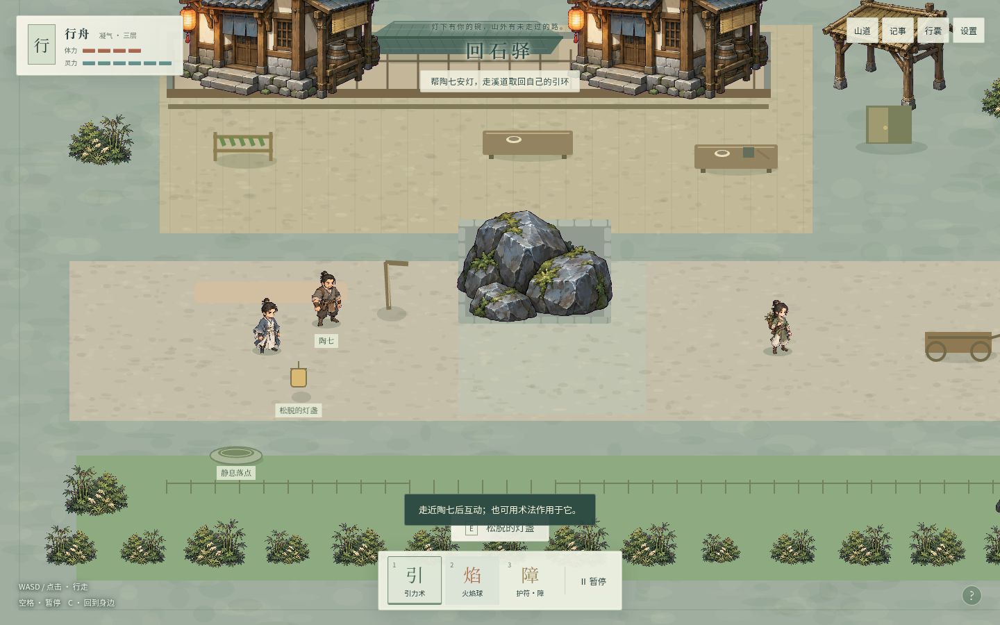
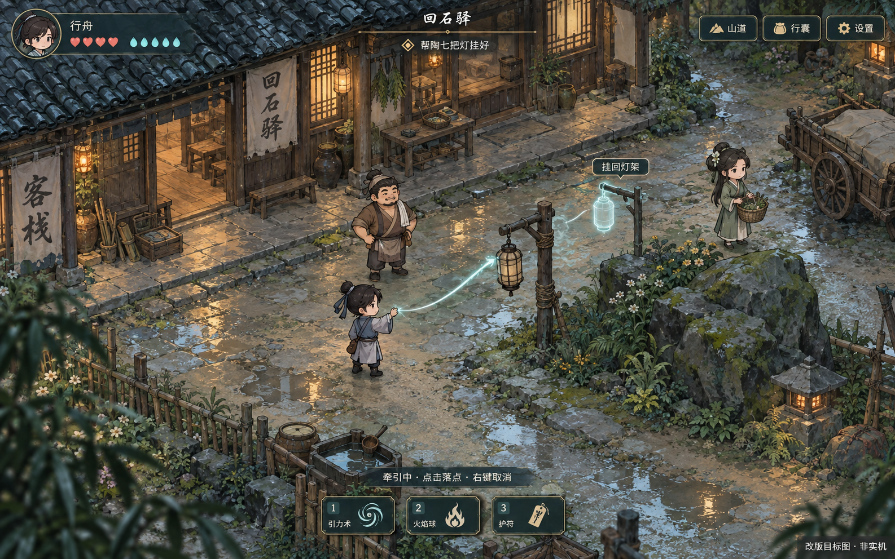

# 《山门之外》画面与交互改版

2026-09-09。用户试玩反馈：“交互，画面质感等太过粗糙”。这是对当前品质的明确否定。已上线的 0.1.0 证明了流程可达，不能据此继续宣称美术和操作体验达到交付要求。

本轮先收敛可审阅的改版目标。继承已经确认的空间冒险、原创修士、二维斜俯视手绘和四场景内容；不重开小说研究、类型选择或已确认事项。本文是既有设计的质量修订，不是已实现报告。

## 当前画面与目标

| 当前实机 | 改版材质与构图目标（非实机） |
| --- | --- |
|  |  |

目标图使用内置 imagegen 生成，完整提示词见 [image-prompt.txt](quality-review/image-prompt.txt)。不使用其他游戏的资产。目标图是局部质感参考，不能作为可玩证据，也不能整张铺进游戏代替可交互场景。

**目标图需要在实现时纠正的地方：**人物占屏偏大，正式机位仍遵循原设计的角色高度约 7%–9%，需同时看清玩家、目标与危险；图中牵灯处多画了一根支架，实际只应有一盏可移动灯与一个固定空钩；装饰细节要在默认视野下收敛，不能淹没落点与路径。界面文案、灵力数量和交互位置以运行状态为准，不使用图片烘焙文字。此图不是新关卡布局，固定地标与两条通路的游戏逻辑仍由原地图定义。

## 已核实的问题

1. **世界像素材拼贴。** 同一画面里，屋舍与角色较细，地面、桌子、灯和木车却是扁平方块。路径是大矩形，石头下露出矩形底座，竹草排列重复，缺少连续的地理关系。
2. **角色缺少有意义的动作。** 行走主要是静态图翻转和摆动；扶灯、伸手、收术、协作等原设计动作没有充分落实。同伴跟到位置不等于表现了协作。
3. **操作模式不清。** 术法按钮的选中状态不能清楚区分“已选术法”和“正在瞄准”；牵住物体后同一次点击从走路变成移物。当前说明写“点地面放下”，实际还要另点“放下”。
4. **菜单与对话打断行走。** Chrome 1440×900 实际新建人物后，行囊打开再关闭，paused 从 false 变为 true；结束陶七对话，dialogue 已清空但 paused 仍为 true。记录见 [interaction-audit.json](quality-review/interaction-audit.json)。
5. **反馈依赖文字。** 场景上常驻小标签较多，物件形态、角色动作、操作成功/失败的短反馈不足。归灯后仍有“松脱的灯盏”旧标签与重复灯表现的风险。

核验基点 e340438。本轮是诊断与目标设计，没有把旧的 28 项通过用例改写成新画面的验收证据。

## 统一的视觉修订

保持清爽的中高明度，用接触影、局部冷暖与材质层次建立空间。石青 `#718C88`、墨青 `#294A48`、湿木 `#745B43`、纸色 `#EEE7D2`、灯暖 `#DFA65D`、术法青白 `#ABE1CE`。不靠整屏压暗或叠雾遮住粗糙资产。

- **地面**：不规则石缝、磨损边缘、泥土与草的过渡服从道路和使用痕迹；水岸连续，岸线、落差与真正阻挡对齐。远离行动点的细节降对比。
- **建筑与道具**：屋檐、木架、桌椅、车、绳与石头统一斜俯视角、比例、线条和光向；撤掉可见的碰撞底座与临时方块表现。庭院建筑组成一个连贯的地方。
- **人物**：两款玩家及两位同伴共享尺度和落脚关系，补齐可辨的行走循环、转向、起术/收术、受击；扶灯与稳舟等关键协作有专属姿态，不用整个人物摇晃代替动作。
- **层次**：地面、接触影、人物器物、屋檐树冠分别处理。前景只在边缘形成框景，必要遮挡时淡出，不挡目标或出口。
- **界面**：场景仍占主要空间；常驻保留资源、一个当前意图、三术法和暂停。小型墨青操作条配暖木/黄铜细边，长阅读区保留浅纸色。中文正文采用清晰的系统无衬线，目标 18px，宋体限于地点与少量标题。

四处场景都执行同一品质门槛，不只改出生点：回石驿突出灯架—回石—桌边的生活关系；溪道突出湿岸—踏石—雨棚的水流关系；工棚突出林路进入工作区的疏密变化；石渡让主闸、泄水、低滩与山脊在地形上读得懂。归来沿用原机位和物件位置，靠风铃、工位、木车及共同地图体现结果。

## 操作规则修订

| 场合 | 玩家操作与反馈 | 不得损失的原有能力 |
| --- | --- | --- |
| 普通移动 | 点地面即出现短落点标记；悬停可交互物显示具体动词，例如“交谈”“查看灯架”。远处对象点击后走近再执行；新指令清掉旧的待互动指令 | WASD、点击寻路、出口交互均保留 |
| 选择术法 | 1/2/3 或按钮进入明确的瞄准模式；光标/准线和动作条同时说明当前动作。Esc/右键退出，不能只保留难辨的按钮高亮 | 暂停中预先指定一个动作，恢复后只执行一次 |
| 引力术 | 点物牵起；随后移动鼠标预览可达轨迹、落点虚影和阻挡原因；点击有效落点开始移物，抵达后自动放下。移动中仍可取消，不自动穿越障碍 | 保留自由落点与手动放下；留势有独立明确入口，不被自动释放吞掉 |
| 精确放物 | 靠近灯钩/机关目标时给出窄范围吸附预览，只有模型判定合法才提示可放；失败保留牵物并说明原因 | 不绕过距离、视线、体力、灵力、机关前提或物理位置 |
| 火与护符 | 出手前显示目标/方向与消耗；成功、湿物不燃、被挡、护符挡住一击分别用短动作和声音表达 | 危险与护符朝向不能被全屏粒子遮住 |
| 菜单/对话 | 记住进入前是否由玩家暂停。行走时打开、关闭后继续；原本主动暂停时关闭后仍暂停。对话翻页不瞬间恢复；失焦/失败不被菜单关闭误恢复 | 所有规则仍由模型裁决；不能只从 UI 强行改状态 |
| 完成事件 | 灯确实挂好，角色松手，灯光稳定，标签变为完成状态；一段简短回声足够 | 文字记事保留，成功事实只结算一次 |

菜单恢复属于原规格未落实的修正；自动放下与窄范围吸附属于本次明确提出的交互细化。要与留势、闸门回弹、暂停队列一起验证，不能为了少一次点击破坏空间解题。

## 实施与验收顺序

1. **回石驿可操作样段**：统一地面、屋舍、回石、灯、桌与三个人物，完成移动—交谈—牵灯—归架—自由继续。验收材料必须是浏览器实机截图和连续操作记录，不能用本页目标图充数。
2. **交互与动作贯通**：实现上述输入状态、暂停恢复、法术预览和关键动作；同伴协作有可见响应。检查连续快速点击、取消、键盘切换、暂停与失焦等边界。
3. **四场景与归来统一**：把材质、空间层次、道具、人物动作和声音规范扩到溪道、工棚、石渡及所有归来变化。出生点与后续场景不能出现品质断层。
4. **重新试玩与发布**：新版本分别走通主渡、山脊、两种引环练法和返驿；检查 1440×900、1280×720、低动效与静音。每个实际里程碑验证后提交推送 Git，公网继续使用原入口，并核对线上版本。

门槛分开记录：模型/浏览器流程验证、画面与交互规格核验、用户试玩感受。旧 Goal 的完成记录不自动代表本次质量反馈已解决。Mac 未实测的限制仍保留。

本轮交付是问题证据、目标图和完整改版范围；运行代码与公网 0.1.0 尚未替换。后续先以可操作样段证明目标可落地，再扩展全部场景；不以“加了特效”“又通过了测试”代替品质验收。
